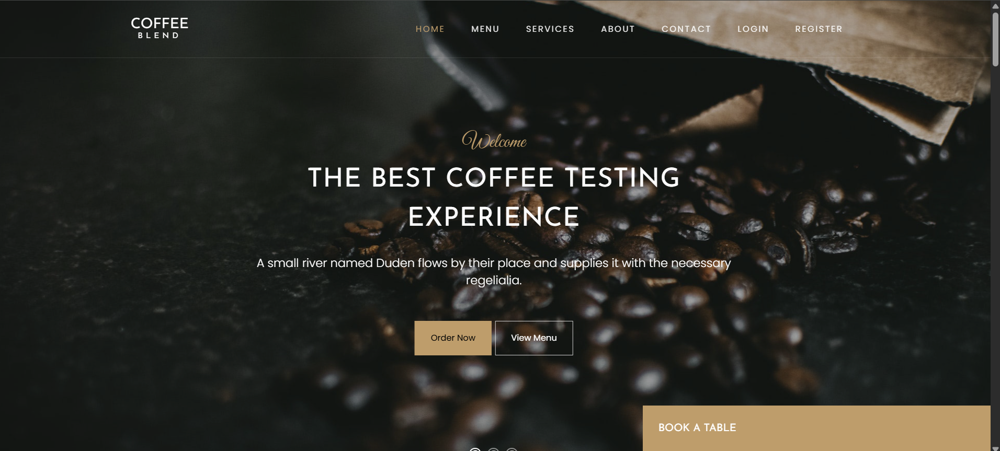
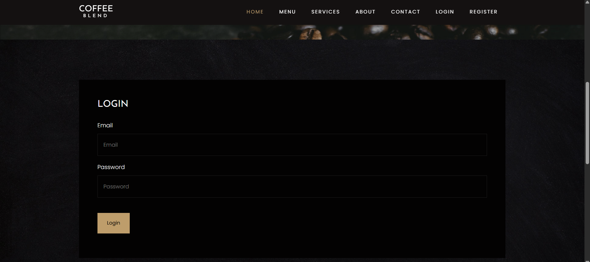
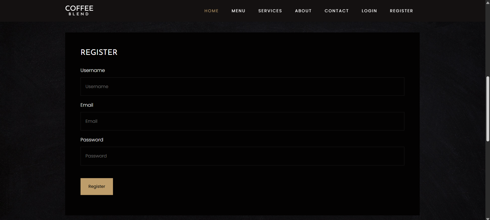
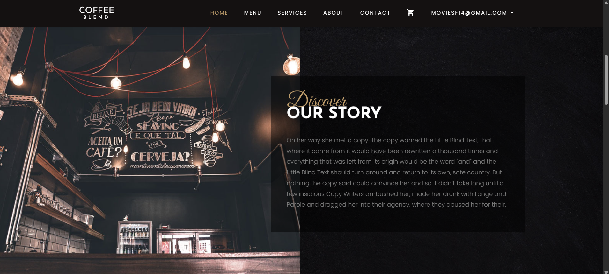
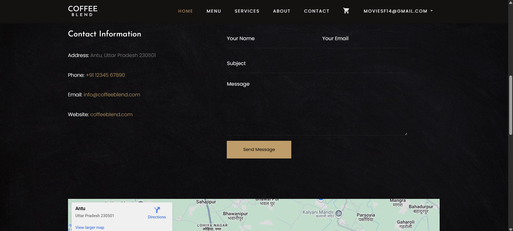
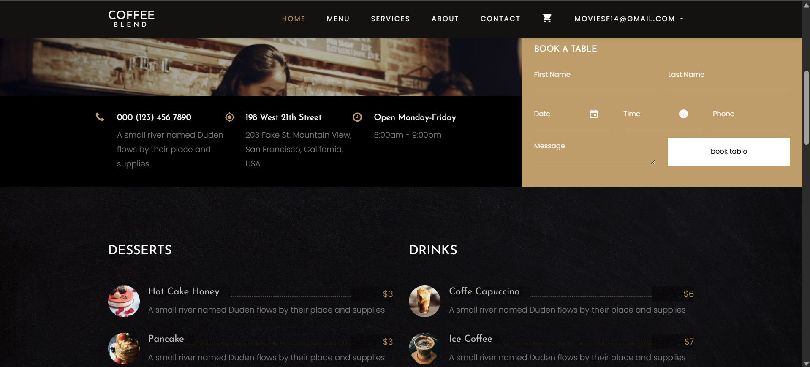

<h1 align="center">☕ CoffeeBlend – Online Coffee Store</h1>

  
  
  
  
  

---

## 🛍️ Overview

**CoffeeBlend** is a fully functional, responsive e-commerce web app built for coffee lovers. With a sleek design and smooth shopping experience, users can browse, buy, and book easily.

---

## ✨ Features

- 📱 **Responsive Design** – Seamless on mobile, tablet & desktop  
- 🛒 **Product Catalog** – View product details and images  
- 🔐 **User Auth** – Register/Login for users and admins  
- 🛍️ **Cart System** – Add to cart, update quantity, checkout  
- 📦 **Order Management** – Admin can view and manage orders  
- 🧑‍💼 **Admin Panel** – Manage products, users, and categories  
- 🌟 **Customer Reviews** – Users can write product reviews  
- 📬 **Contact Form** – Simple contact system for feedback  
- 📅 **Booking System** – Table booking for coffee café  

---

## 🧰 Tech Stack

### Frontend:
- 🖌️ HTML5, CSS3, SCSS  
- 💫 JavaScript, jQuery  
- 🎨 Bootstrap 5  

### Backend:
- 🐘 PHP 8+  
- 🗄️ MySQL  

---

## 📁 Project Structure

    coffeeblend-online-coffee-store/
    ├── admin-panel/       # Admin dashboard files
    ├── auth/              # Authentication logic
    ├── booking/           # Table booking logic
    ├── config/            # DB configuration
    ├── css/               # Stylesheets
    ├── fonts/             # Fonts
    ├── images/            # All image assets
    ├── includes/          # Header, footer, reusable parts
    ├── js/                # JavaScript files
    ├── products/          # Product management
    ├── reviews/           # Customer review logic
    ├── scss/              # SCSS styling
    ├── users/             # User management
    ├── 404.php            # Custom error page
    ├── about.php          # About section
    ├── contact.php        # Contact page
    ├── index.php          # Landing page
    ├── menu.php           # Product catalog
    ├── services.php       # Services offered
    ├── LICENSE            # Apache-2.0 License
    └── README.md          # Project documentation

---

## 📸 Screenshots

| 🏠 Home Page | 🔐 Login Page | 📝 Register Page |
|-------------|---------------|------------------|
|  |  |  |

| ℹ️ About Page | 📞 Contact Page | 🛍️ Menu Page |
|---------------|----------------|----------------|
|  |  |  |

| 📅 Booking Page |
|-----------------|
|  |

---

🚀 Installation & Setup

1️⃣ Clone the Repository

    git clone https://github.com/bhaktofmahakal/coffeeblend-online-coffee-store.git
    cd coffeeblend-online-coffee-store

2️⃣ Configure Your Environment

    Make sure PHP, MySQL, and a web server (like XAMPP) are installed.
    
    Import the SQL database provided (e.g., coffeeblend.sql) into phpMyAdmin.
    
    Update config/config.php with your database credentials.

3️⃣ Run the App

    Move the project folder into your server directory (e.g., htdocs in XAMPP):
    
    http://localhost/coffeeblend-online-coffee-store/

 ---   

🤝 Contributing

    We welcome contributions from the community!
    
    # Step 1 – Fork the repo
    
    # Step 2 – Create your feature branch
    
    git checkout -b feature/amazing-feature
    
    # Step 3 – Commit your changes
    
    git commit -m "Add amazing feature"
    
    # Step 4 – Push to the branch
    
    git push origin feature/amazing-feature
    
    # Step 5 – Create a Pull Request

---   

📄 License

This project is licensed under the Apache-2.0 License.

---

🙏 Acknowledgements

    Inspired by modern café e-commerce experiences
    
    Bootstrap for UI framework
    
    PHP & MySQL for backend operations
    
    Coffee Enthusiasts everywhere ☕
